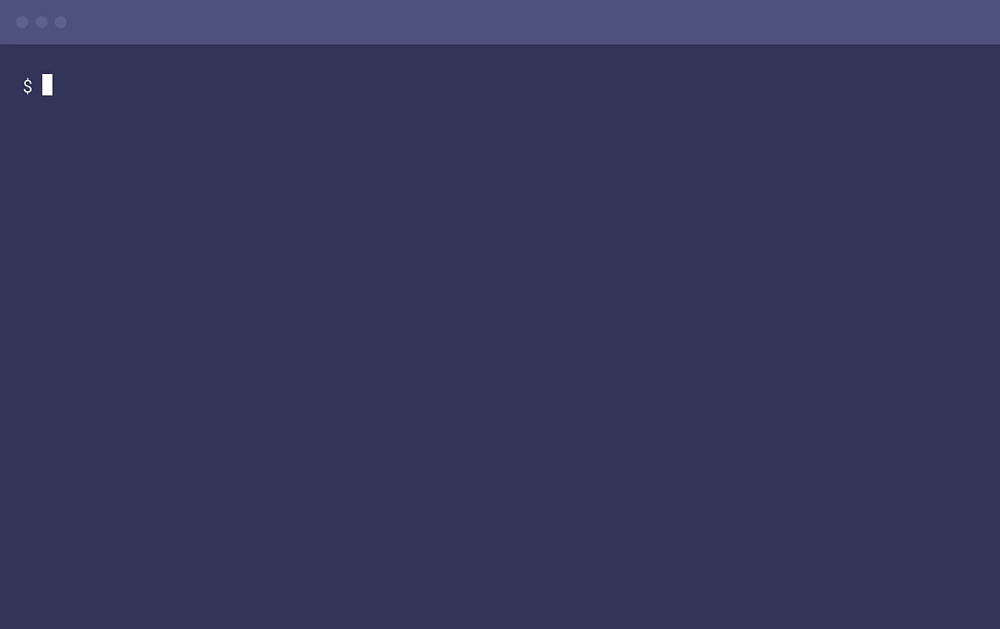

Labs
====

### Code

- codapi - Interactive code examples , https://codapi.org/ , https://github.com/nalgeon/codapi
- pico - 모든 것을 SSH를 이용해서 웹서비스를 관리하는 오픈소스 모음, https://pico.sh/, https://github.com/picosh/pico
- giant-otter - Swagger API doc을 수집하고 이를 다시 Swagger ui로 보여주는 웹어플리케이션, https://github.com/stray-cat-developers/giant-otter

### LoadBalancer

-  envoy 프록시 - GCP도 사용하는 클라우드 기반 고성능 로드밸런서, https://www.envoyproxy.io/, https://github.com/envoyproxy/envoy
-  ㅁ

### Load Testing 

- nighthawk - L7 (HTTP/HTTPS/HTTP2/HTTP3) performance characterization tool, https://github.com/envoyproxy/nighthawk
  - 리포팅: https://github.com/fortio/fortio#report-only-ui
- fortio - 작고 빠른 go기반 부하 테스트 도구 - https://github.com/fortio/fortio
- k6 - 개발자를 위한 오픈 소스 부하 테스트 도구
  - https://k6.io/open-source/
  - "유닛 테스팅처럼 성능 테스팅하기"
  - ES6 JavaScript 스크립팅 지원
  - 테스트로직과 설정옵션이 모두 JS코드
  - CI와 연동하기 쉬운 자동화 옵션  
ㅤ  * check : assert 처럼 동작하지만 실행을 중단하지는 않고, 결과값을 저장하고 계속 진행 
ㅤ  * threshold : 실패율, 응답시간, 응답시간 범위내 성공율 등으로 pass/fail 조건 설정 가능
  - HTTP/1.1, HTTP/2, WebSocket 지원
  - HTML Form, Cookies, Crypto, 커스텀 메트릭, 환경변수, 테스트를 위한 로컬파일 로딩 등 지원
  - 로컬, k6 Cloud(유료), 클러스터(지원예정) 에서 실행 가능
  - 브라우저 세션을 녹화한 HAR(HTTP Archive format) 파일을 읽어서 k6 스크립트로 변환 가능
  - InfluxDB (+Grafana) 나 JSON 으로 메트릭 저장 또는 k6 Cloud에 업로드도 가능
  - 
  - 적용 예시: [lemonbase github actios에 도입](https://blog.lemonbase.team/%EB%B0%B1%EC%97%94%EB%93%9C-%EA%B8%B0%EC%88%A0%EA%B3%BC%EC%A0%9C-%EC%84%B1%EB%8A%A5-%ED%85%8C%EC%8A%A4%ED%8A%B8-%ED%99%98%EA%B2%BD-%EA%B5%AC%EC%B6%95-2f0dfd5ce9c3)
  - 

